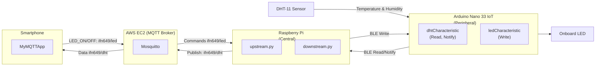
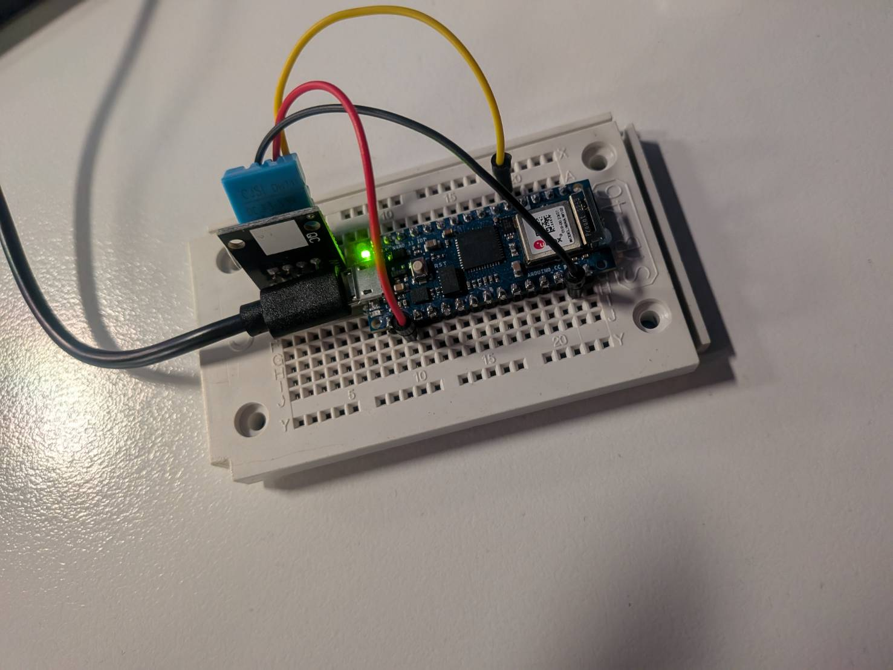

# System Architecture

 
 

# DHT-11 and Arduino Nano 33 IoT wiring

 

| DHT-11 Pin (row)    | Wire Color | Jumper: **from → to** | Nano 33 IoT Pin (row) |
| ------------------- | ---------- | --------------------- | --------------------- |
| **– GND** *(B2)*    | **Black**  | **B2 → H22**          | **GND** *(row 22)*    |
| **+ VCC** *(B3)*    | **Red**    | **B3 → H10**          | **3V3** *(row 10)*    |
| **S / DATA** *(B4)* | **Yellow** | **B4 → A19**          | **D2** *(row 19)*     |

Breadboard quick rule: 
A–E are connected across each row, and F–J are connected across each row; the center trench isolates the two sides. 
So to wire parts, run a jumper from the sensor’s pin to the same row number where the matching Nano pin lands. 
Row tags like H22/H10/A19 simply mean “the physical row the Nano pin sits on.”

# Preparation

- [ ] Check the public IP address of your EC2 instance

- [ ] Open two terminals on the Raspberry Pi

    - [ ] Terminal 1: Upstream (read temperature and humidity)

    - [ ] Terminal 2: Downstream (control LED ON/OFF)

- [ ] In the smartphone app (MyMQTT), update the EC2 public IP address

- [ ] In the smartphone app (MyMQTT), update the topics

- [ ] Make sure the Raspberry Pi is accessible via VNC Viewer

# Demo Steps
## Upstream (DHT11 → Arduino → BLE → Pi → MQTT → EC2)

On the smartphone app MyMQTT, subscribe to the topic

Connect the Arduino and start the upstream bridge on the Pi

Verify that the temperature and humidity data from Arduino appears in the app

## Downstream (Smartphone → MQTT → Pi → BLE → Arduino)

From the smartphone app, publish LED_ON to the topic

The orange LED on the Arduino will turn on

From the smartphone app, publish LED_OFF to the ifn649 topic

The orange LED on the Arduino will turn off